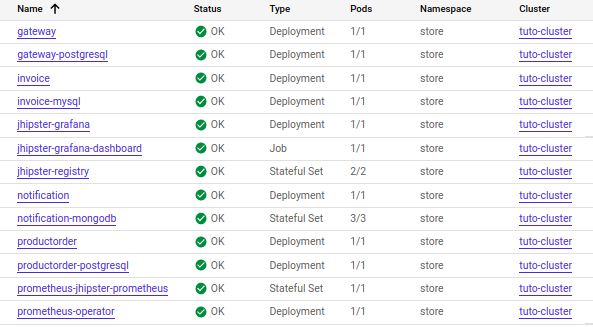
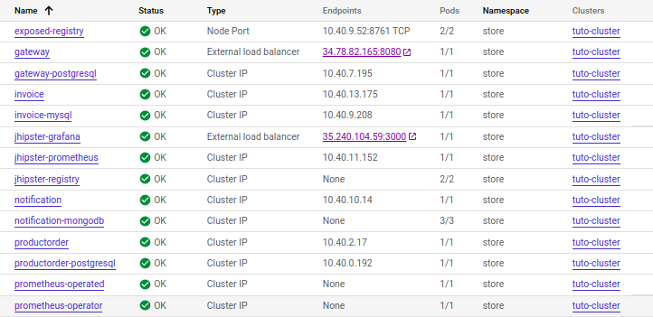
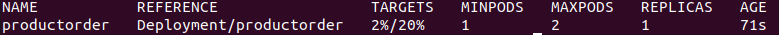
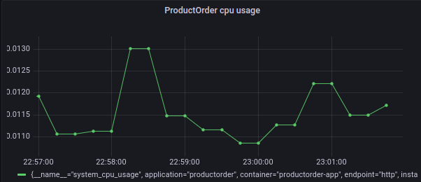
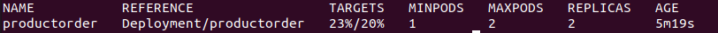
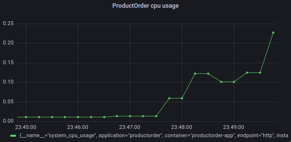

<h1 align="center">
   
  Microservices Architectures - Practices with JHipter 
   
</h1>

## Members of the homework group

- **Firstname**: Meriem , **Lastname**: Ouadih , **Github ID**: ouadih1630 , **Email**: ouadihmeri@gmail.com
- **Firstname**: Amine , **Lastname**: Oubaamrane , **Github ID**: amineouba , **Email**: amine.oubaamrane@grenoble-inp.org
- **Firstname**: Hiba , **Lastname**: Touderti , **Github ID**: ToudertiHiba , **Email**: hibatouderti@gmail.com

## Deployment of Microservices with JHipster on GCP

### Workloads

### Services

## Enabling scalability on GCP for one microservice

We used a HorizontalPodAutoscaler for the ProductOrder microservice with a threshold of 20% for the cpu usage to make sure there is a scale up.

## Monitoring dashboard

This is a dashboard created in Grafana that shows the cpu usage (collected by Prometheus) of the ProductOrder microservice for the last 5 minutes. We can see that the cpu usage is very low as there is no operations in progress. 

##  Load injection with Gatling for demonstrating scalability

Using *gatling-charts-highcharts-bundle-3.3.1* because it is compatible with Java 11, we lauched three simulation scripts on the ProductOrder microservice at the same time to make sure that the cpu usage exceed the hpa threshold.

We can see that a replica is added as the cpu usage crosses the threshold.

We can also see the cpu usage increasing on the Grafana dashboard.

You can find the Gatling reports here : 
