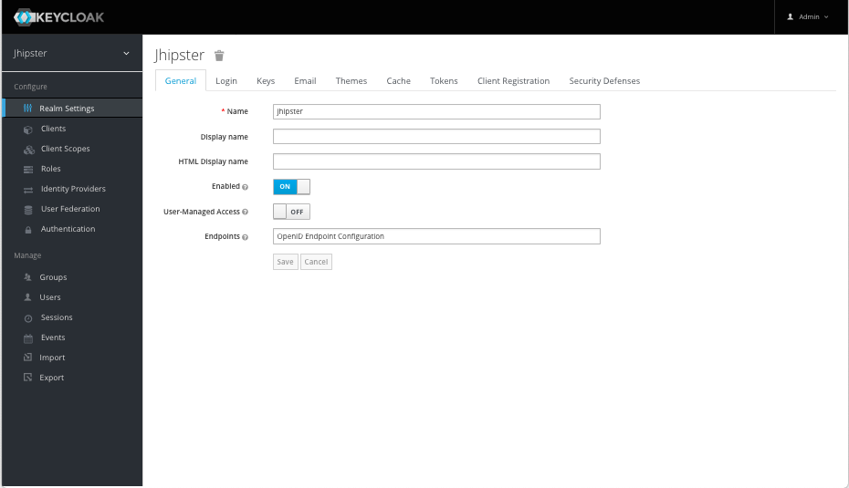

# Tutoriel sur les microservices avec JHipster :: Microservices

## Gestion et authenfication OAuth2 des utilisateurs

Plusieurs gestionnaires d'authentification des utilisateurs sont proposés par le générateur JHipster. https://www.jhipster.tech/security/

### Gestion et authenfication OAuth2 des utilisateurs avec JHipster UAA

Regénerez la gateway
```bash
mkdir -p ~/github/mastering-microservices/uaa
cd  ~/github/mastering-microservices/uaa
jhipster

```

```
? Which *type* of application would you like to create? JHipster UAA server (for microservice OAuth2 authentication)
? What is the base name of your application? uaa
? As you are running in a microservice architecture, on which port would like your server to run? It should be unique to avoid  port conflicts. 9999
? What is your default Java package name? com.mycompany.store
? Which service discovery server do you want to use? JHipster Registry (uses Eureka, provides Spring Cloud Config support and monitoring dashboards)
? Which *type* of database would you like to use? SQL (H2, MySQL, MariaDB, PostgreSQL, Oracle, MSSQL)
? Which *production* database would you like to use? MySQL
? Which *development* database would you like to use? H2 with disk-based persistence
? Do you want to use the Spring cache abstraction? Yes, with the Hazelcast implementation (distributed cache, for multiple nodes)
? Do you want to use Hibernate 2nd level cache? Yes
? Would you like to use Maven or Gradle for building the backend? Gradle
? Which other technologies would you like to use?
? Would you like to enable internationalization support? Yes
? Please choose the native language of the application English
? Please choose additional languages to install French
? Besides JUnit and Jest, which testing frameworks would you like to use? Gatling, Cucumber
? Would you like to install other generators from the JHipster Marketplace? No
```

Regénérez l'API gateway et les microservices en sélectionnant le JHipster UAA server pour l'authentification.

[Plus d'information sur JHipster UAA](https://www.jhipster.tech/using-uaa/)

### Gestion et authenfication OAuth2 des utilisateurs avec Keycloak


```bash
mkdir -p ~/github/mastering-microservices/gateway_keycloak
cd  ~/github/mastering-microservices/gateway_keycloak
jhipster
```
Répondez aux questions suivantes:
```
? Which *type* of application would you like to create? Microservice gateway
? What is the base name of your application? gateway
? As you are running in a microservice architecture, on which port would like your server to run? It should be unique to avoid port conflicts. 8080
? What is your default Java package name? com.mycompany.store
? Which service discovery server do you want to use? JHipster Registry (uses Eureka, provides Spring Cloud Config support and monitoring dashboards)
? Which *type* of authentication would you like to use? OAuth 2.0 / OIDC Authentication (stateful, works with Keycloak and Okta)
? Which *type* of database would you like to use? SQL (H2, MySQL, MariaDB, PostgreSQL, Oracle, MSSQL)
? Which *production* database would you like to use? MySQL
? Which *development* database would you like to use? H2 with disk-based persistence
? Do you want to use Hibernate 2nd level cache? Yes
? Would you like to use Maven or Gradle for building the backend? Gradle
? Which other technologies would you like to use?
? Which *Framework* would you like to use for the client? Angular 6
? Would you like to enable *SASS* support using the LibSass stylesheet preprocessor? Yes
? Would you like to enable internationalization support? Yes
? Please choose the native language of the application English
? Please choose additional languages to install French
? Besides JUnit and Jest, which testing frameworks would you like to use?
? Would you like to install other generators from the JHipster Marketplace? No
```

```bash
jhipster import-jdl ../tutorial/gateway-jdl-all.jh
```

Lancez le container keycloak
```bash
docker-compose -f src/main/docker/keycloak.yml up -d
docker-compose -f src/main/docker/keycloak.yml ps
docker-compose -f src/main/docker/keycloak.yml logs -f
```

Lancez le service de registre
```bash
cd  ~/github/mastering-microservices/gateway_keycloak
docker-compose -f src/main/docker/jhipster-registry.yml up -d
docker-compose -f src/main/docker/jhipster-registry.yml logs -f
```

Lancez la gateway en profil `dev` et les microservices.
```bash
cd  ~/github/mastering-microservices/gateway_keycloak
./gradlew
```

Loggez-vous via la gateway (admin Administration)
```bash
open http://localhost:8080
```
> Que se passe t'il ?

Loggez-vous sur la console d'adminstration de Keycloak (admin admin)
```bash
open http://localhost:9080
open http://localhost:9080/auth/admin/master/console/#/realms/jhipster
```

Configurez le realm jhipster pour
* créer de nouveaux utilisateurs,
* changer le thème,
* autoriser le login via les réseaux sociaux,
* activer le One Time Password (via [Google Authenticator](https://play.google.com/store/apps/details?id=com.google.android.apps.authenticator2)),
* ...



[Plus d'information sur Keycloak](https://www.jhipster.tech/security/)

### Gestion et authenfication OAuth2 des utilisateurs avec OKTA

[Plus d'information sur OKTA](https://www.jhipster.tech/security/)

### "Backend for Frontend Pattern" pour l'application Ionic store-ion

Générez une seconde gateway exposant une API simplifiée de `online-store.jh` pour l'application mobile Ionic `store-ion`.
